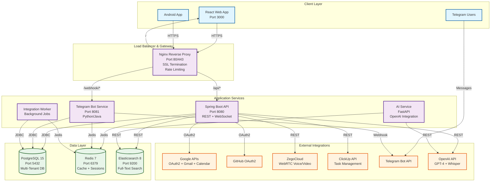
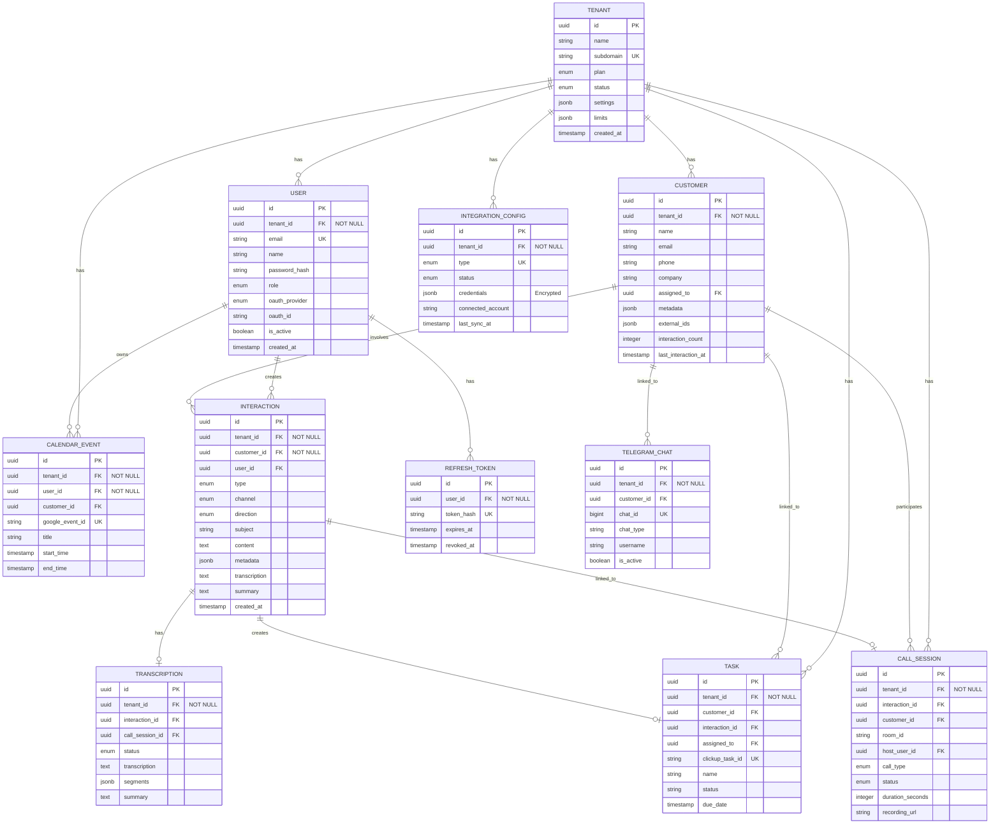
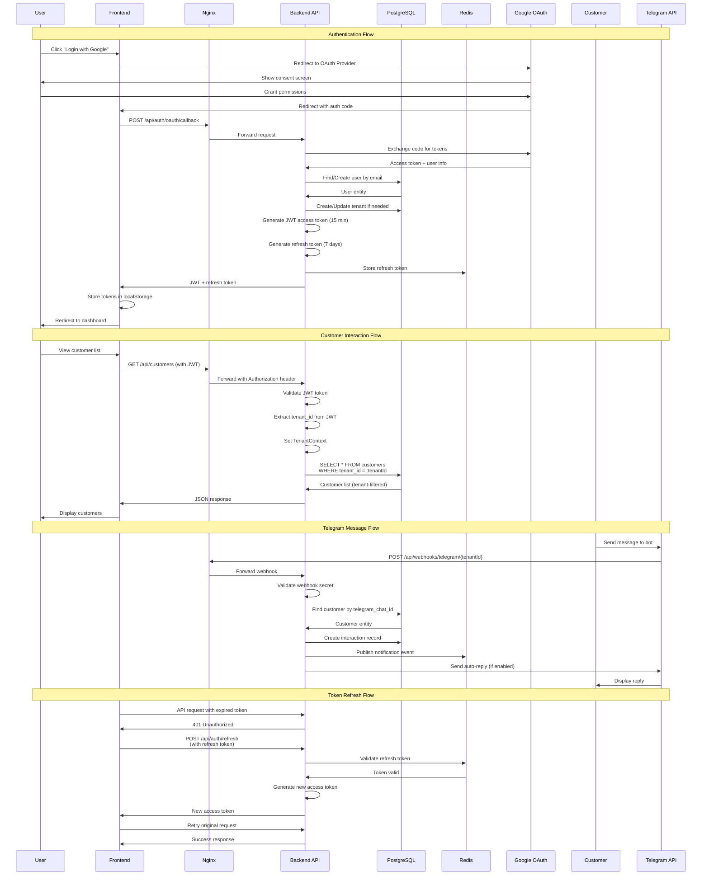

# NeoBit Multi-Tenant CRM System - Architecture Diagrams

This document contains all architecture diagrams for the NeoBit CRM System.

---

## 1. System Architecture Diagram

This diagram shows the high-level system architecture including all services, databases, and external integrations.



### Architecture Components

**Client Layer:**
- **React Web App**: Modern SPA built with React 18, Vite, TailwindCSS
- **Android App**: Native Android application using Kotlin/Java
- **Telegram Users**: Customers interacting via Telegram bot

**Application Services:**
- **Spring Boot API**: Main REST API with JWT authentication, multi-tenancy support
- **Telegram Bot Service**: Handles Telegram webhooks and message routing
- **Integration Worker**: Background jobs for syncing external data (Gmail, Calendar, ClickUp)
- **AI Service**: FastAPI service for OpenAI integration (GPT-4, Whisper)

**Data Layer:**
- **PostgreSQL**: Primary database with row-level security for multi-tenancy
- **Redis**: Session storage, caching, rate limiting
- **Elasticsearch**: Full-text search and analytics (Phase 2)

**External Integrations:**
- **Google**: OAuth2, Gmail API, Calendar API
- **GitHub**: OAuth2 authentication
- **ZegoCloud**: WebRTC for voice/video calls
- **ClickUp**: Task management integration
- **Telegram**: Bot API for customer messaging
- **OpenAI**: GPT-4 for AI assistant, Whisper for STT

---

## 2. Multi-Tenant Data Model Diagram

This ERD shows the database schema with multi-tenant isolation strategy.



### Multi-Tenancy Strategy

**Row-Level Isolation:**
- Every table (except `tenants`) includes `tenant_id` as a foreign key
- Hibernate filters automatically append `WHERE tenant_id = :tenantId` to all queries
- PostgreSQL Row-Level Security (RLS) provides additional database-level protection

**Key Design Decisions:**
1. **Shared Schema**: All tenants share the same database schema for easier maintenance
2. **Tenant ID Indexing**: All tenant-scoped tables have indexes on `tenant_id` for performance
3. **Cascade Deletes**: When a tenant is deleted, all associated data is automatically removed
4. **Unique Constraints**: Email uniqueness is scoped per tenant (`UNIQUE(tenant_id, email)`)

---

## 3. Workflow / Sequence Diagram

This diagram shows the complete authentication and customer interaction workflow.



### Key Workflows Explained

**1. OAuth2 Authentication:**
- User initiates login via Google/GitHub
- Backend exchanges authorization code for access token
- User is created/updated in database with tenant association
- JWT tokens are issued and stored

**2. Multi-Tenant Data Access:**
- Every API request includes JWT with `tenant_id` claim
- Backend extracts tenant ID and sets it in `TenantContext` (ThreadLocal)
- Hibernate filters automatically append tenant filter to all queries
- Database returns only tenant-specific data

**3. Telegram Integration:**
- Telegram sends webhook to backend when customer messages bot
- Backend validates webhook and finds associated customer
- Interaction is logged in database
- Real-time notification sent to frontend via WebSocket

**4. Token Refresh:**
- Access tokens expire after 15 minutes
- Frontend automatically refreshes using refresh token (7 days)
- Refresh tokens are stored in Redis for revocation support

---

## 4. Performance & Security Diagram

This diagram illustrates performance optimizations and security layers.

```mermaid
flowchart TB
    subgraph "Security Layers"
        SSL[SSL/TLS Termination<br/>Nginx]
        RATE[Rate Limiting<br/>Nginx + Redis]
        JWT[JWT Validation<br/>Spring Security Filter]
        TENANT[Tenant Isolation<br/>Hibernate Filter + RLS]
        ENCRYPT[Data Encryption<br/>AES-256 for OAuth tokens]
        RBAC[Role-Based Access Control<br/>PLATFORM_ADMIN, VENDOR_ADMIN, AGENT]
    end

    subgraph "Performance Optimizations"
        CACHE[Redis Cache<br/>- Session storage<br/>- API response cache<br/>- Rate limit counters]
        INDEX[Database Indexes<br/>- tenant_id indexes<br/>- Full-text search indexes<br/>- Composite indexes]
        CONN[Connection Pooling<br/>HikariCP<br/>Max: 20 connections]
        ASYNC[Async Processing<br/>- Email sync workers<br/>- Calendar sync workers<br/>- AI processing]
        CDN[Static Asset CDN<br/>React build assets]
    end

    subgraph "Monitoring & Logging"
        HEALTH[Health Checks<br/>Spring Actuator<br/>/actuator/health]
        AUDIT[Audit Logging<br/>All data modifications<br/>stored in audit_logs]
        METRICS[Application Metrics<br/>- Request latency<br/>- Error rates<br/>- Cache hit rates]
    end

    subgraph "Data Protection"
        BACKUP[Database Backups<br/>Daily automated backups<br/>Point-in-time recovery]
        RLS[Row-Level Security<br/>PostgreSQL RLS policies<br/>Additional tenant isolation]
        ENCRYPT_DB[Encryption at Rest<br/>PostgreSQL TDE<br/>Encrypted volumes]
    end

    SSL --> RATE
    RATE --> JWT
    JWT --> TENANT
    TENANT --> RBAC

    CACHE --> INDEX
    INDEX --> CONN
    CONN --> ASYNC
    ASYNC --> CDN

    HEALTH --> AUDIT
    AUDIT --> METRICS

    BACKUP --> RLS
    RLS --> ENCRYPT_DB

    classDef security fill:#ffebee,stroke:#c62828,stroke-width:2px
    classDef performance fill:#e3f2fd,stroke:#1565c0,stroke-width:2px
    classDef monitoring fill:#f1f8e9,stroke:#558b2f,stroke-width:2px
    classDef protection fill:#fff3e0,stroke:#ef6c00,stroke-width:2px

    class SSL,RATE,JWT,TENANT,ENCRYPT,RBAC security
    class CACHE,INDEX,CONN,ASYNC,CDN performance
    class HEALTH,AUDIT,METRICS monitoring
    class BACKUP,RLS,ENCRYPT_DB protection
```



### Security Measures

**1. Authentication & Authorization:**
- **OAuth2**: Industry-standard social login (Google, GitHub)
- **JWT Tokens**: Stateless authentication with short-lived access tokens (15 min)
- **Refresh Tokens**: Long-lived tokens (7 days) stored securely in Redis
- **RBAC**: Three-tier role system with granular permissions

**2. Multi-Tenant Isolation:**
- **Application Level**: Hibernate filters automatically filter by `tenant_id`
- **Database Level**: PostgreSQL Row-Level Security (RLS) policies
- **Network Level**: Tenant context extracted from JWT, validated on every request

**3. Data Protection:**
- **Encryption at Rest**: OAuth tokens encrypted with AES-256 before storage
- **Encryption in Transit**: All traffic over HTTPS (TLS 1.3)
- **Audit Logging**: All data modifications logged for compliance

**4. Rate Limiting:**
- **API Rate Limits**: 100 requests/minute per user (configurable)
- **OAuth Rate Limits**: 10 OAuth attempts/hour per IP
- **Redis-backed**: Distributed rate limiting using Redis

### Performance Optimizations

**1. Caching Strategy:**
- **Session Cache**: User sessions in Redis (TTL: 7 days)
- **API Response Cache**: Frequently accessed data cached (TTL: 5 minutes)
- **Database Query Cache**: Hibernate second-level cache for read-heavy operations

**2. Database Optimization:**
- **Indexes**: All `tenant_id` columns indexed for fast filtering
- **Composite Indexes**: `(tenant_id, created_at)` for time-based queries
- **Full-Text Search**: PostgreSQL GIN indexes for customer/interaction search
- **Connection Pooling**: HikariCP with max 20 connections per instance

**3. Async Processing:**
- **Background Workers**: Email/Calendar sync runs asynchronously
- **AI Processing**: Transcription and summarization queued and processed async
- **WebSocket**: Real-time notifications without polling

**4. Scalability:**
- **Horizontal Scaling**: Backend API can be scaled to multiple instances
- **Load Balancing**: Nginx distributes traffic across backend instances
- **Database Read Replicas**: Can be added for read-heavy workloads

---

## Diagram Export Instructions

To export these diagrams as images:

1. **Using Mermaid Live Editor:**
   - Copy diagram code to https://mermaid.live
   - Export as PNG/SVG

2. **Using VS Code:**
   - Install "Markdown Preview Mermaid Support" extension
   - Preview this file and export diagrams

3. **Using CLI:**
   ```bash
   npm install -g @mermaid-js/mermaid-cli
   mmdc -i ARCHITECTURE_DIAGRAMS.md -o diagrams/
   ```

4. **Using GitHub:**
   - Push to GitHub repository
   - GitHub automatically renders Mermaid diagrams in markdown files

5. **Using HTML Viewer:**
   - Open `view-diagrams.html` in your browser
   - All diagrams will render automatically

---

## Additional Resources

- [System Explanation](./SYSTEM_EXPLANATION.md) - Detailed system architecture explanation
- [Video Presentation Guide](./VIDEO_PRESENTATION_GUIDE.md) - Guide for video presentation
- [Main Architecture Documentation](./ARCHITECTURE.md) - Complete architecture documentation
- [API Documentation](./API_DOC.md) - API reference
- [Database Schema](../backend/schema.sql) - SQL schema with comments
- [Deployment Guide](../README.md#deployment) - Step-by-step deployment instructions

---

**Document Version**: 1.0  
**Last Updated**: 2024  
**Maintained by**: NeoBit Team
