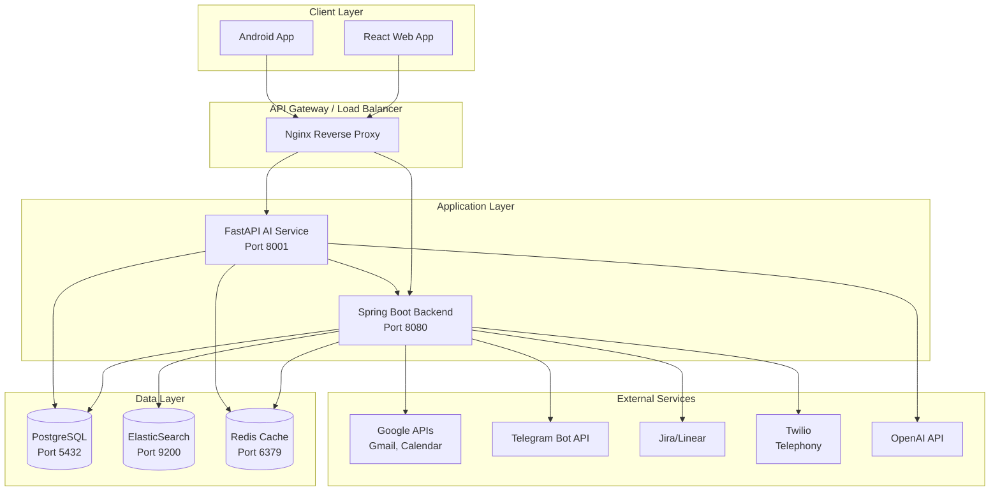

# Multi-Tenant CRM System - Architecture

## System Architecture Diagram



## Component Details

### 1. Frontend (React + TypeScript)
- **Framework**: React 18 with TypeScript
- **State Management**: Zustand
- **Styling**: Tailwind CSS
- **Routing**: React Router v6
- **HTTP Client**: Axios

### 2. Backend (Spring Boot)
- **Framework**: Spring Boot 3.2
- **Security**: Spring Security + OAuth2 + JWT
- **ORM**: Spring Data JPA with Hibernate
- **Database**: PostgreSQL 16
- **Search**: ElasticSearch 8.x
- **Documentation**: SpringDoc OpenAPI

### 3. AI Service (Python FastAPI)
- **Framework**: FastAPI
- **LLM**: OpenAI GPT-4
- **Voice**: Whisper (STT), gTTS/OpenAI (TTS)
- **Async**: Full async/await support

### 4. Database Schema

```
┌─────────────────┐     ┌─────────────────┐
│     tenants     │     │      users      │
├─────────────────┤     ├─────────────────┤
│ id (UUID)       │◄────│ tenant_id       │
│ name            │     │ email           │
│ slug (unique)   │     │ password_hash   │
│ domain          │     │ role            │
│ settings (JSONB)│     │ ...             │
└─────────────────┘     └─────────────────┘
                              │
         ┌────────────────────┼────────────────────┐
         │                    │                    │
         ▼                    ▼                    ▼
┌─────────────────┐  ┌─────────────────┐  ┌─────────────────┐
│    accounts     │  │   customers     │  │  interactions   │
├─────────────────┤  ├─────────────────┤  ├─────────────────┤
│ tenant_id       │  │ tenant_id       │  │ tenant_id       │
│ name            │  │ account_id      │  │ customer_id     │
│ industry        │  │ first_name      │  │ type            │
│ owner_id        │  │ email           │  │ direction       │
│ ...             │  │ lead_status     │  │ subject         │
└─────────────────┘  │ ...             │  │ ...             │
                     └─────────────────┘  └─────────────────┘
```

## Multi-Tenancy Strategy

### Approach: Shared Database with Tenant ID
- All tables include `tenant_id` column
- Row-Level Security (RLS) considered but not implemented
- Tenant context propagated via JWT claims
- Middleware extracts and validates tenant for each request

### Security Measures
1. **Authentication**: OAuth2 + JWT tokens
2. **Authorization**: Role-based (Admin, Agent, Viewer)
3. **Tenant Isolation**: All queries filtered by tenant_id
4. **API Security**: Rate limiting, CORS, input validation

## Deployment Architecture

```
┌──────────────────────────────────────────────────────────┐
│                    Docker Compose                         │
├──────────────────────────────────────────────────────────┤
│                                                          │
│  ┌──────────┐  ┌──────────┐  ┌──────────┐  ┌──────────┐ │
│  │ Frontend │  │ Backend  │  │    AI    │  │  Nginx   │ │
│  │  :80     │  │  :8080   │  │  :8001   │  │  (proxy) │ │
│  └──────────┘  └──────────┘  └──────────┘  └──────────┘ │
│                                                          │
│  ┌──────────┐  ┌──────────┐  ┌──────────┐               │
│  │ Postgres │  │  Redis   │  │ Elastic  │               │
│  │  :5432   │  │  :6379   │  │  :9200   │               │
│  └──────────┘  └──────────┘  └──────────┘               │
│                                                          │
└──────────────────────────────────────────────────────────┘
```

## API Endpoints Overview

### Authentication
- `POST /api/auth/login` - Login
- `POST /api/auth/register` - Register
- `POST /api/auth/refresh` - Refresh token
- `POST /api/auth/logout` - Logout

### CRM Core
- `GET/POST /api/customers` - Customer CRUD
- `GET/POST /api/accounts` - Account CRUD
- `GET/POST /api/interactions` - Interaction CRUD
- `GET/POST /api/tasks` - Task CRUD

### AI Service
- `POST /ai/chat` - Conversational AI
- `POST /ai/summarize/entity` - Summarization
- `POST /ai/voice/transcribe` - Speech-to-text
- `POST /ai/voice/synthesize` - Text-to-speech
- `GET /ai/insights/customer/{id}` - Customer insights

## Technology Stack Summary

| Layer | Technology |
|-------|------------|
| Frontend | React, TypeScript, Tailwind CSS, Zustand |
| Backend | Spring Boot, Spring Security, JPA |
| AI Service | FastAPI, OpenAI, Whisper |
| Database | PostgreSQL, ElasticSearch, Redis |
| Deployment | Docker, Docker Compose, GitHub Actions |
| Integrations | Gmail, Calendar, Telegram, Jira, Twilio |

