# NeoBit CRM - System Architecture

> Complete architectural documentation for the NeoBit Multi-Tenant CRM System

---

## Table of Contents

1. [System Overview](#system-overview)
2. [Multi-Tenancy Architecture](#multi-tenancy-architecture)
3. [Authentication & Authorization](#authentication--authorization)
4. [Backend Architecture](#backend-architecture)
5. [Frontend Architecture](#frontend-architecture)
6. [Mobile Architecture](#mobile-architecture)
7. [Integration Architecture](#integration-architecture)
8. [Data Architecture](#data-architecture)
9. [Phase 2: AI & Voice](#phase-2-ai--voice)
10. [Infrastructure](#infrastructure)

---

## System Overview

### High-Level Architecture Diagram

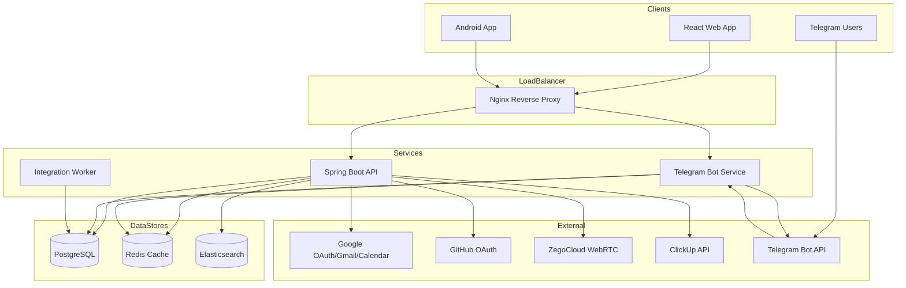
```mermaid
flowchart TB
    subgraph Clients
        WEB[React Web App]
        MOB[Android App]
        TG[Telegram Users]
    end

    subgraph LoadBalancer
        NGINX[Nginx Reverse Proxy]
    end

    subgraph Services
        API[Spring Boot API]
        BOT[Telegram Bot Service]
        WORKER[Integration Worker]
    end

    subgraph DataStores
        PG[(PostgreSQL)]
        REDIS[(Redis Cache)]
        ES[(Elasticsearch)]
    end

    subgraph External
        GOOGLE[Google OAuth/Gmail/Calendar]
        GITHUB[GitHub OAuth]
        ZEGO[ZegoCloud WebRTC]
        CLICKUP[ClickUp API]
        TGAPI[Telegram Bot API]
    end

    WEB --> NGINX
    MOB --> NGINX
    TG --> TGAPI --> BOT

    NGINX --> API
    NGINX --> BOT

    API --> PG
    API --> REDIS
    API --> ES
    BOT --> PG
    BOT --> REDIS
    WORKER --> PG

    API --> GOOGLE
    API --> GITHUB
    API --> ZEGO
    API --> CLICKUP
    BOT --> TGAPI
```

### ASCII Alternative

```
┌──────────────────────────────────────────────────────────────────────────┐
│                              CLIENTS                                      │
│  ┌─────────────┐    ┌─────────────┐    ┌─────────────┐                   │
│  │  React SPA  │    │ Android App │    │  Telegram   │                   │
│  └──────┬──────┘    └──────┬──────┘    └──────┬──────┘                   │
└─────────┼──────────────────┼──────────────────┼──────────────────────────┘
          │                  │                  │
          ▼                  ▼                  ▼
┌──────────────────────────────────────────────────────────────────────────┐
│                         NGINX LOAD BALANCER                               │
│                    (SSL Termination, Rate Limiting)                       │
└─────────────────────────────┬────────────────────────────────────────────┘
                              │
        ┌─────────────────────┼─────────────────────┐
        ▼                     ▼                     ▼
┌───────────────┐    ┌───────────────┐    ┌───────────────┐
│  Spring Boot  │    │  Telegram Bot │    │  Integration  │
│   REST API    │    │    Service    │    │    Worker     │
│   Port 8080   │    │   Port 8081   │    │  (Background) │
└───────┬───────┘    └───────┬───────┘    └───────┬───────┘
        │                    │                    │
        └─────────────────────┼─────────────────────┘
                              │
        ┌─────────────────────┼─────────────────────┐
        ▼                     ▼                     ▼
┌───────────────┐    ┌───────────────┐    ┌───────────────┐
│  PostgreSQL   │    │     Redis     │    │ Elasticsearch │
│   Port 5432   │    │   Port 6379   │    │   Port 9200   │
└───────────────┘    └───────────────┘    └───────────────┘
```

---

## Multi-Tenancy Architecture

### Tenant Isolation Strategy

We use **Row-Level Isolation with Tenant ID** combined with optional **PostgreSQL Row-Level Security (RLS)**.

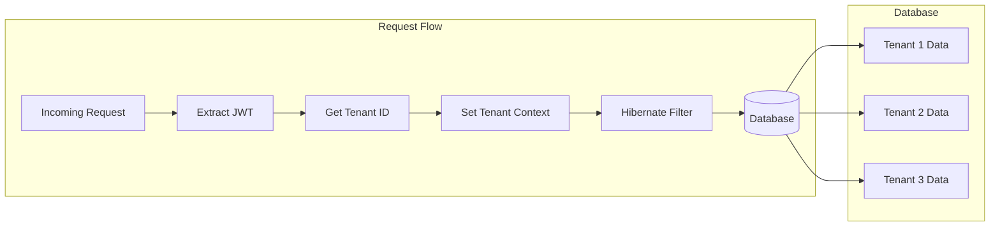
```mermaid
flowchart LR
    subgraph Request Flow
        REQ[Incoming Request] --> JWT[Extract JWT]
        JWT --> TID[Get Tenant ID]
        TID --> CTX[Set Tenant Context]
        CTX --> FILTER[Hibernate Filter]
        FILTER --> DB[(Database)]
    end

    subgraph Database
        DB --> T1[Tenant 1 Data]
        DB --> T2[Tenant 2 Data]
        DB --> T3[Tenant 3 Data]
    end
```

### Tenant Context Implementation

```java
// TenantContext.java - ThreadLocal storage for tenant
public class TenantContext {
    private static final ThreadLocal<UUID> CURRENT_TENANT = new ThreadLocal<>();
    
    public static void setTenantId(UUID tenantId) {
        CURRENT_TENANT.set(tenantId);
    }
    
    public static UUID getTenantId() {
        return CURRENT_TENANT.get();
    }
    
    public static void clear() {
        CURRENT_TENANT.remove();
    }
}

// TenantFilter.java - Hibernate filter
@FilterDef(name = "tenantFilter", 
           parameters = @ParamDef(name = "tenantId", type = UUID.class))
@Filter(name = "tenantFilter", condition = "tenant_id = :tenantId")
public abstract class TenantAwareEntity {
    @Column(name = "tenant_id", nullable = false)
    private UUID tenantId;
}
```

### Database Schema Per Tenant (Alternative)

For high-security requirements, schema-per-tenant can be implemented:

```sql
-- Create tenant schema
CREATE SCHEMA tenant_abc123;

-- Set search path for tenant
SET search_path TO tenant_abc123, public;

-- Tables created in tenant schema
CREATE TABLE tenant_abc123.customers (...);
```

---

## Authentication & Authorization

### OAuth2 + JWT Flow

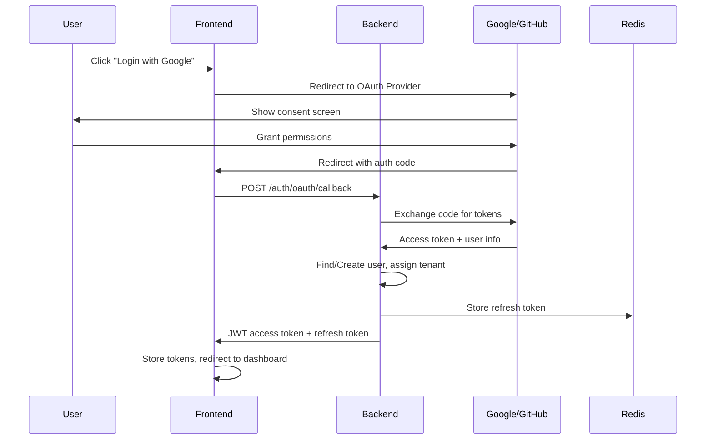
```mermaid
sequenceDiagram
    participant U as User
    participant F as Frontend
    participant B as Backend
    participant G as Google/GitHub
    participant R as Redis

    U->>F: Click "Login with Google"
    F->>G: Redirect to OAuth Provider
    G->>U: Show consent screen
    U->>G: Grant permissions
    G->>F: Redirect with auth code
    F->>B: POST /auth/oauth/callback
    B->>G: Exchange code for tokens
    G->>B: Access token + user info
    B->>B: Find/Create user, assign tenant
    B->>R: Store refresh token
    B->>F: JWT access token + refresh token
    F->>F: Store tokens, redirect to dashboard
```

### Token Structure

```json
// Access Token Payload (JWT)
{
  "sub": "user-uuid",
  "email": "user@example.com",
  "tenantId": "tenant-uuid",
  "roles": ["VENDOR_ADMIN"],
  "iat": 1699900000,
  "exp": 1699900900  // 15 minutes
}

// Refresh Token (stored in Redis)
{
  "tokenId": "refresh-token-uuid",
  "userId": "user-uuid",
  "tenantId": "tenant-uuid",
  "expiresAt": "2024-01-15T00:00:00Z",
  "revoked": false
}
```

### RBAC Permission Matrix

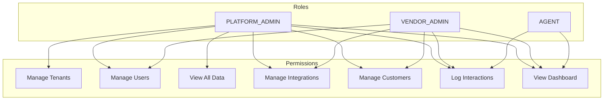
```mermaid
flowchart TD
    subgraph Roles
        PA[PLATFORM_ADMIN]
        VA[VENDOR_ADMIN]
        AG[AGENT]
    end

    subgraph Permissions
        P1[Manage Tenants]
        P2[Manage Users]
        P3[View All Data]
        P4[Manage Integrations]
        P5[Manage Customers]
        P6[Log Interactions]
        P7[View Dashboard]
    end

    PA --> P1
    PA --> P2
    PA --> P3
    PA --> P4
    PA --> P5
    PA --> P6
    PA --> P7

    VA --> P2
    VA --> P4
    VA --> P5
    VA --> P6
    VA --> P7

    AG --> P6
    AG --> P7
```

### Token Refresh Flow

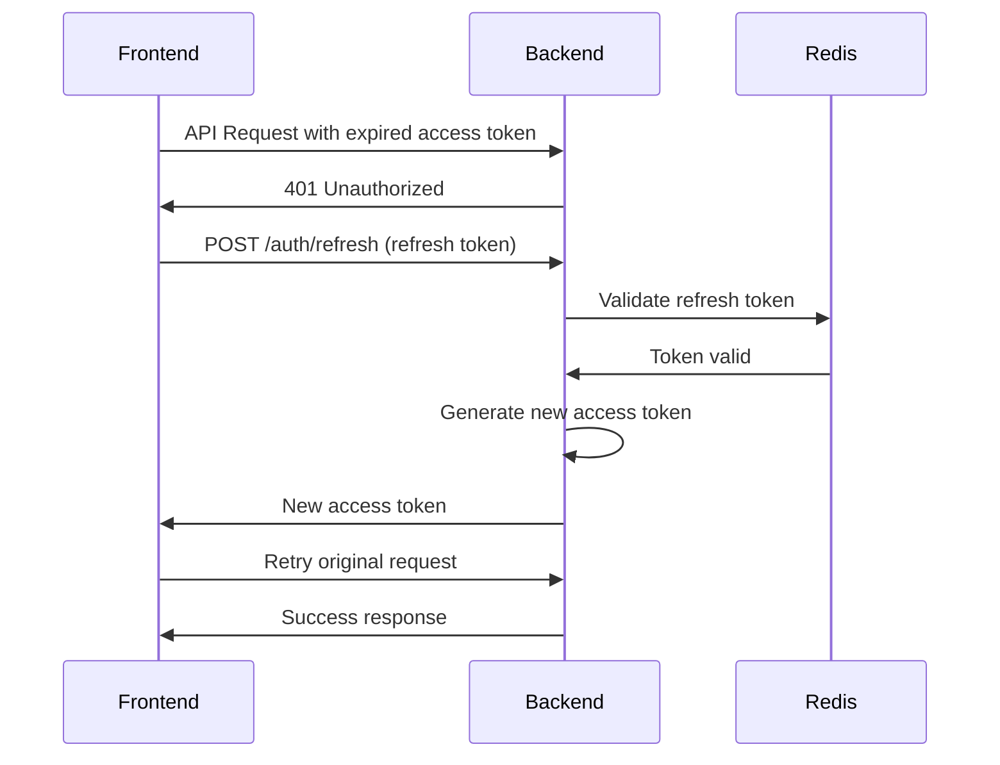
```mermaid
sequenceDiagram
    participant F as Frontend
    participant B as Backend
    participant R as Redis

    F->>B: API Request with expired access token
    B->>F: 401 Unauthorized
    F->>B: POST /auth/refresh (refresh token)
    B->>R: Validate refresh token
    R->>B: Token valid
    B->>B: Generate new access token
    B->>F: New access token
    F->>B: Retry original request
    B->>F: Success response
```

---

## Backend Architecture

### Spring Boot Layer Architecture

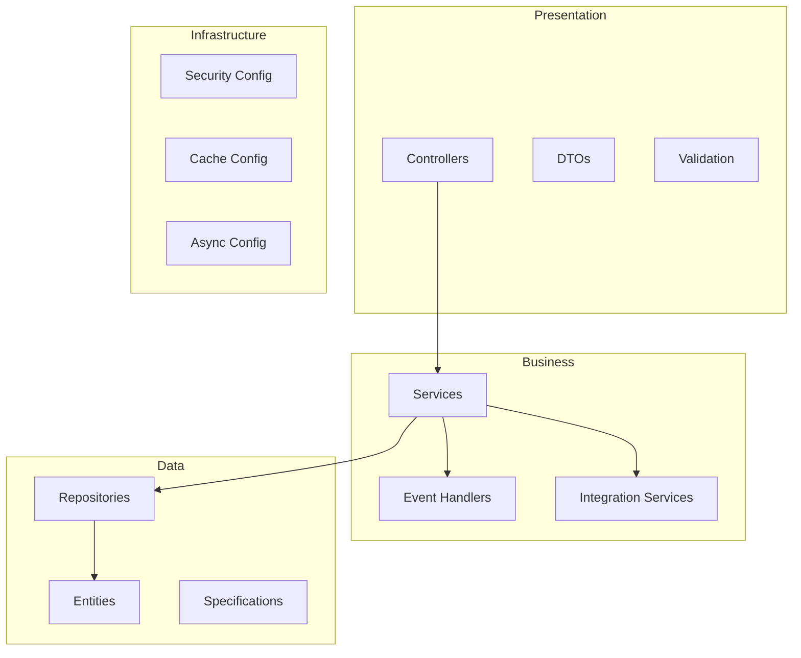
```mermaid
flowchart TB
    subgraph Presentation
        CTRL[Controllers]
        DTO[DTOs]
        VALID[Validation]
    end

    subgraph Business
        SVC[Services]
        EVENT[Event Handlers]
        INT[Integration Services]
    end

    subgraph Data
        REPO[Repositories]
        ENTITY[Entities]
        SPEC[Specifications]
    end

    subgraph Infrastructure
        SEC[Security Config]
        CACHE[Cache Config]
        ASYNC[Async Config]
    end

    CTRL --> SVC
    SVC --> REPO
    SVC --> INT
    SVC --> EVENT
    REPO --> ENTITY
```

### Package Structure

```
com.neobit.crm/
├── config/
│   ├── SecurityConfig.java
│   ├── OAuth2Config.java
│   ├── MultiTenancyConfig.java
│   ├── RedisConfig.java
│   └── WebSocketConfig.java
├── controller/
│   ├── AuthController.java
│   ├── TenantController.java
│   ├── CustomerController.java
│   ├── InteractionController.java
│   └── IntegrationController.java
├── service/
│   ├── AuthService.java
│   ├── TenantService.java
│   ├── CustomerService.java
│   ├── InteractionService.java
│   ├── integration/
│   │   ├── GmailService.java
│   │   ├── CalendarService.java
│   │   ├── ClickUpService.java
│   │   └── ZegoService.java
│   └── ai/
│       ├── AssistantService.java
│       └── TranscriptionService.java
├── repository/
│   ├── UserRepository.java
│   ├── TenantRepository.java
│   ├── CustomerRepository.java
│   └── InteractionRepository.java
├── model/
│   ├── entity/
│   │   ├── User.java
│   │   ├── Tenant.java
│   │   ├── Customer.java
│   │   └── Interaction.java
│   └── enums/
│       ├── Role.java
│       └── InteractionType.java
├── dto/
│   ├── request/
│   └── response/
├── security/
│   ├── JwtTokenProvider.java
│   ├── TenantFilter.java
│   └── CustomOAuth2UserService.java
└── exception/
    ├── GlobalExceptionHandler.java
    └── TenantNotFoundException.java
```

### API Request Lifecycle

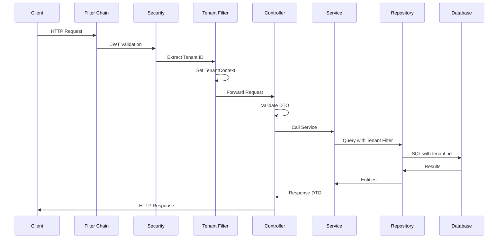
```mermaid
sequenceDiagram
    participant C as Client
    participant F as Filter Chain
    participant S as Security
    participant T as Tenant Filter
    participant CT as Controller
    participant SV as Service
    participant R as Repository
    participant DB as Database

    C->>F: HTTP Request
    F->>S: JWT Validation
    S->>T: Extract Tenant ID
    T->>T: Set TenantContext
    T->>CT: Forward Request
    CT->>CT: Validate DTO
    CT->>SV: Call Service
    SV->>R: Query with Tenant Filter
    R->>DB: SQL with tenant_id
    DB->>R: Results
    R->>SV: Entities
    SV->>CT: Response DTO
    CT->>C: HTTP Response
```

---

## Frontend Architecture

### React Component Tree

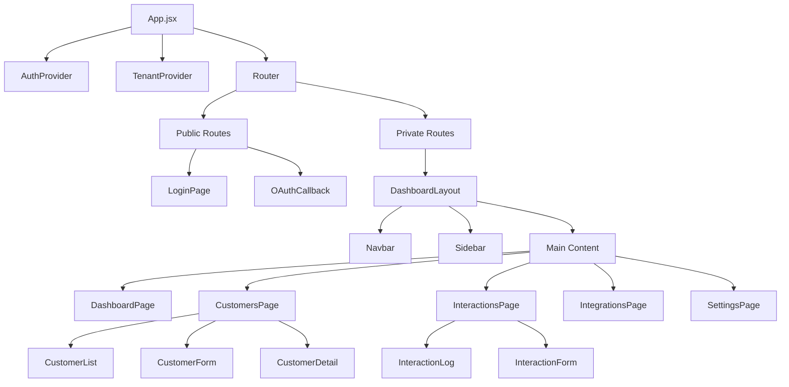
```mermaid
flowchart TB
    APP[App.jsx]
    
    APP --> AUTH[AuthProvider]
    APP --> TENANT[TenantProvider]
    APP --> ROUTER[Router]

    ROUTER --> PUBLIC[Public Routes]
    ROUTER --> PRIVATE[Private Routes]

    PUBLIC --> LOGIN[LoginPage]
    PUBLIC --> OAUTH[OAuthCallback]

    PRIVATE --> LAYOUT[DashboardLayout]
    
    LAYOUT --> NAV[Navbar]
    LAYOUT --> SIDE[Sidebar]
    LAYOUT --> MAIN[Main Content]

    MAIN --> DASH[DashboardPage]
    MAIN --> CUST[CustomersPage]
    MAIN --> INTERACT[InteractionsPage]
    MAIN --> INTEG[IntegrationsPage]
    MAIN --> SETTINGS[SettingsPage]

    CUST --> CUSTLIST[CustomerList]
    CUST --> CUSTFORM[CustomerForm]
    CUST --> CUSTDETAIL[CustomerDetail]

    INTERACT --> INTLOG[InteractionLog]
    INTERACT --> INTFORM[InteractionForm]
```

### State Management (Zustand)

```javascript
// stores/authStore.js
const useAuthStore = create((set, get) => ({
  user: null,
  token: null,
  isAuthenticated: false,
  
  login: async (credentials) => {
    const response = await authApi.login(credentials);
    set({ 
      user: response.user, 
      token: response.accessToken,
      isAuthenticated: true 
    });
  },
  
  logout: () => {
    localStorage.removeItem('token');
    set({ user: null, token: null, isAuthenticated: false });
  },
  
  refreshToken: async () => {
    const response = await authApi.refresh();
    set({ token: response.accessToken });
  }
}));
```

### Folder Structure

```
frontend/src/
├── components/
│   ├── common/
│   │   ├── Button.jsx
│   │   ├── Input.jsx
│   │   ├── Modal.jsx
│   │   └── Table.jsx
│   ├── layout/
│   │   ├── Navbar.jsx
│   │   ├── Sidebar.jsx
│   │   └── DashboardLayout.jsx
│   └── features/
│       ├── customers/
│       ├── interactions/
│       └── integrations/
├── pages/
│   ├── Login.jsx
│   ├── Dashboard.jsx
│   ├── Customers.jsx
│   ├── Interactions.jsx
│   └── Settings.jsx
├── hooks/
│   ├── useAuth.js
│   ├── useCustomers.js
│   └── useWebSocket.js
├── store/
│   ├── authStore.js
│   ├── customerStore.js
│   └── notificationStore.js
├── api/
│   ├── client.js
│   ├── auth.js
│   ├── customers.js
│   └── integrations.js
├── utils/
│   ├── formatters.js
│   └── validators.js
└── App.jsx
```

---

## Mobile Architecture

### Android App Structure

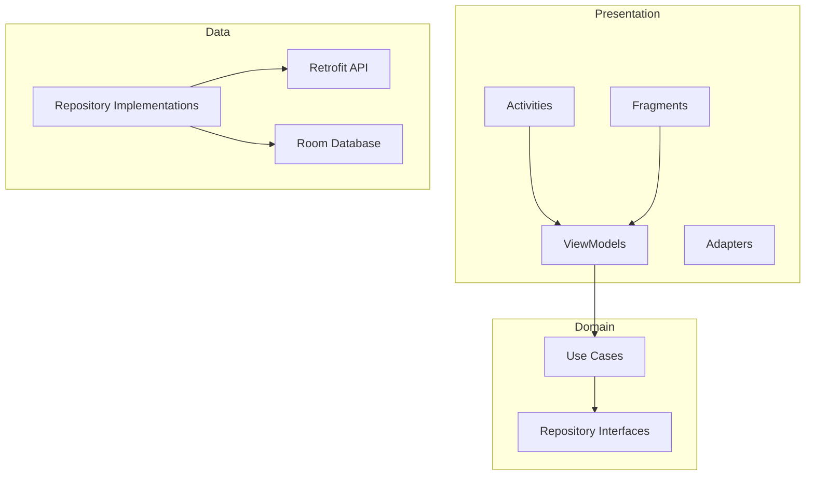
```mermaid
flowchart TB
    subgraph Presentation
        ACT[Activities]
        FRAG[Fragments]
        VM[ViewModels]
        ADAPT[Adapters]
    end

    subgraph Domain
        UC[Use Cases]
        REPO_INT[Repository Interfaces]
    end

    subgraph Data
        REPO_IMPL[Repository Implementations]
        API[Retrofit API]
        DB[Room Database]
    end

    ACT --> VM
    FRAG --> VM
    VM --> UC
    UC --> REPO_INT
    REPO_IMPL --> API
    REPO_IMPL --> DB
```

### Android Package Structure

```
com.neobit.crm/
├── ui/
│   ├── auth/
│   │   ├── LoginActivity.java
│   │   └── LoginViewModel.java
│   ├── customer/
│   │   ├── CustomerListFragment.java
│   │   ├── CustomerDetailFragment.java
│   │   └── CustomerViewModel.java
│   ├── interaction/
│   │   ├── InteractionLogFragment.java
│   │   └── InteractionViewModel.java
│   └── main/
│       └── MainActivity.java
├── data/
│   ├── api/
│   │   ├── ApiService.java
│   │   └── AuthInterceptor.java
│   ├── repository/
│   │   ├── CustomerRepository.java
│   │   └── InteractionRepository.java
│   └── local/
│       ├── AppDatabase.java
│       └── CustomerDao.java
├── model/
│   ├── Customer.java
│   ├── Interaction.java
│   └── User.java
├── util/
│   ├── TokenManager.java
│   └── NotificationHelper.java
└── NeoBitApplication.java
```

---

## Integration Architecture

### Gmail & Calendar Integration

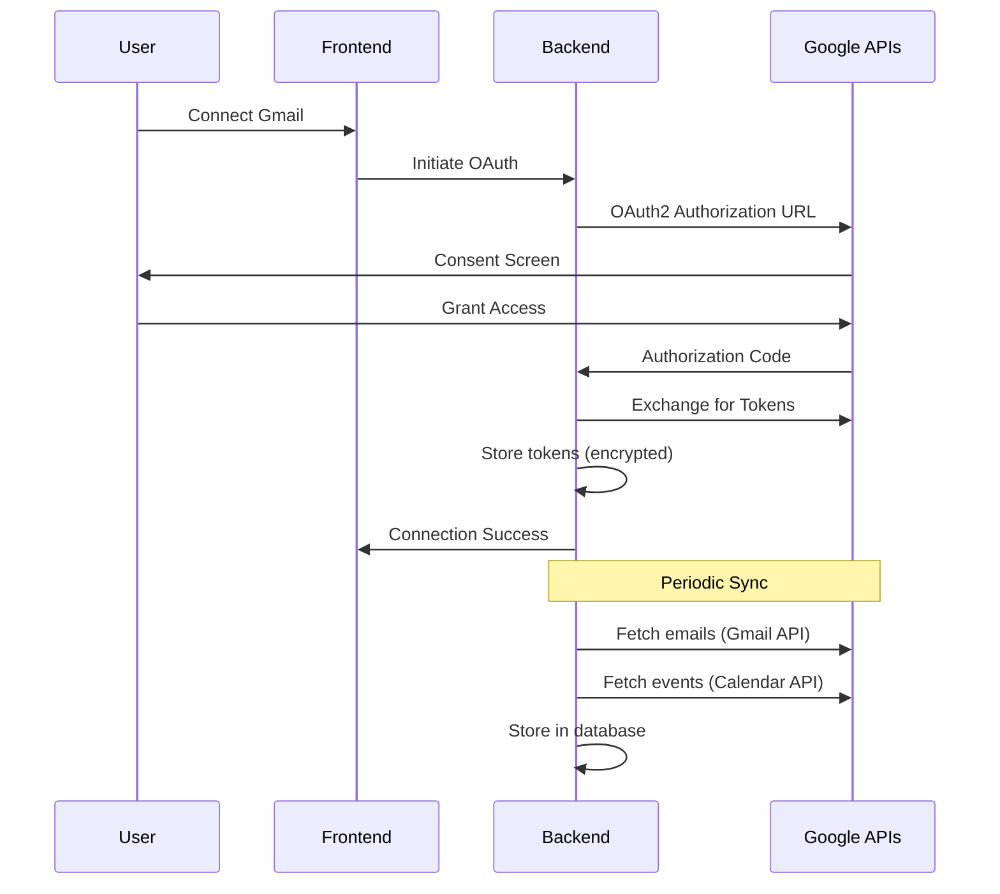
```mermaid
sequenceDiagram
    participant U as User
    participant F as Frontend
    participant B as Backend
    participant G as Google APIs

    U->>F: Connect Gmail
    F->>B: Initiate OAuth
    B->>G: OAuth2 Authorization URL
    G->>U: Consent Screen
    U->>G: Grant Access
    G->>B: Authorization Code
    B->>G: Exchange for Tokens
    B->>B: Store tokens (encrypted)
    B->>F: Connection Success

    Note over B,G: Periodic Sync
    B->>G: Fetch emails (Gmail API)
    B->>G: Fetch events (Calendar API)
    B->>B: Store in database
```

### Telegram Bot Integration

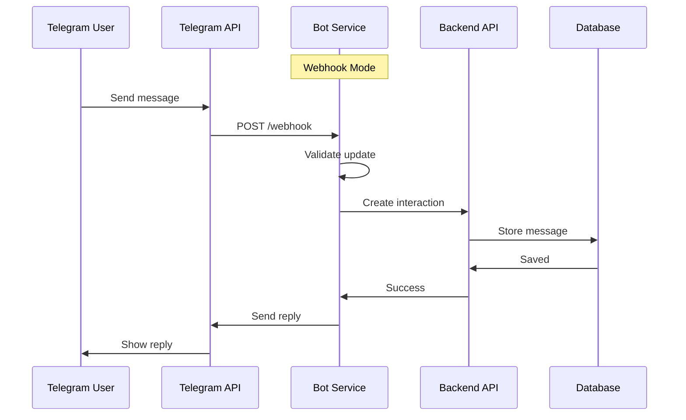
```mermaid
sequenceDiagram
    participant TU as Telegram User
    participant TG as Telegram API
    participant BOT as Bot Service
    participant API as Backend API
    participant DB as Database

    Note over BOT: Webhook Mode
    TU->>TG: Send message
    TG->>BOT: POST /webhook
    BOT->>BOT: Validate update
    BOT->>API: Create interaction
    API->>DB: Store message
    DB->>API: Saved
    API->>BOT: Success
    BOT->>TG: Send reply
    TG->>TU: Show reply
```

### ZegoCloud Voice/Video Integration

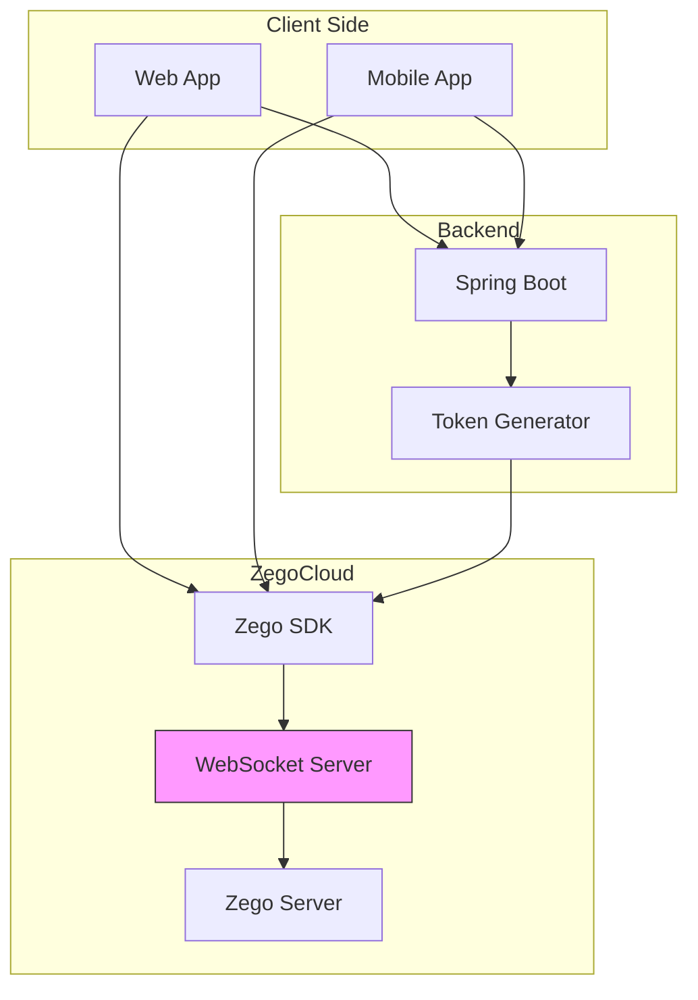
```mermaid
flowchart TB
    subgraph Client Side
        WEB[Web App]
        MOB[Mobile App]
    end

    subgraph ZegoCloud
        ZEGO_SDK[Zego SDK]
        ZEGO_SERVER[Zego Server]
        WSS[WebSocket Server]
    end

    subgraph Backend
        API[Spring Boot]
        TOKEN[Token Generator]
    end

    WEB --> ZEGO_SDK
    MOB --> ZEGO_SDK
    ZEGO_SDK --> WSS
    WSS --> ZEGO_SERVER

    WEB --> API
    MOB --> API
    API --> TOKEN
    TOKEN --> ZEGO_SDK

    style WSS fill:#f9f,stroke:#333
```

### ZegoCloud WebSocket Configuration

```javascript
// Zego connection config
const zegoConfig = {
  appID: 1934093598,
  serverWSS: 'wss://webliveroom1934093598-api.coolzcloud.com/ws',
  serverWSSBackup: 'wss://webliveroom1934093598-api-bak.coolzcloud.com/ws',
  
  // Token generated server-side
  generateToken: async (userId, roomId) => {
    const response = await fetch('/api/integrations/zego/token', {
      method: 'POST',
      body: JSON.stringify({ userId, roomId })
    });
    return response.json();
  }
};

// Initialize Zego Engine
const zg = new ZegoExpressEngine(zegoConfig.appID, zegoConfig.serverWSS);

// Login to room
await zg.loginRoom(roomId, token, { userID, userName });

// Start publishing stream (voice/video)
const localStream = await zg.createStream({ camera: { video: true, audio: true }});
await zg.startPublishingStream(streamId, localStream);
```

### Telephony + Zego Integration Flow

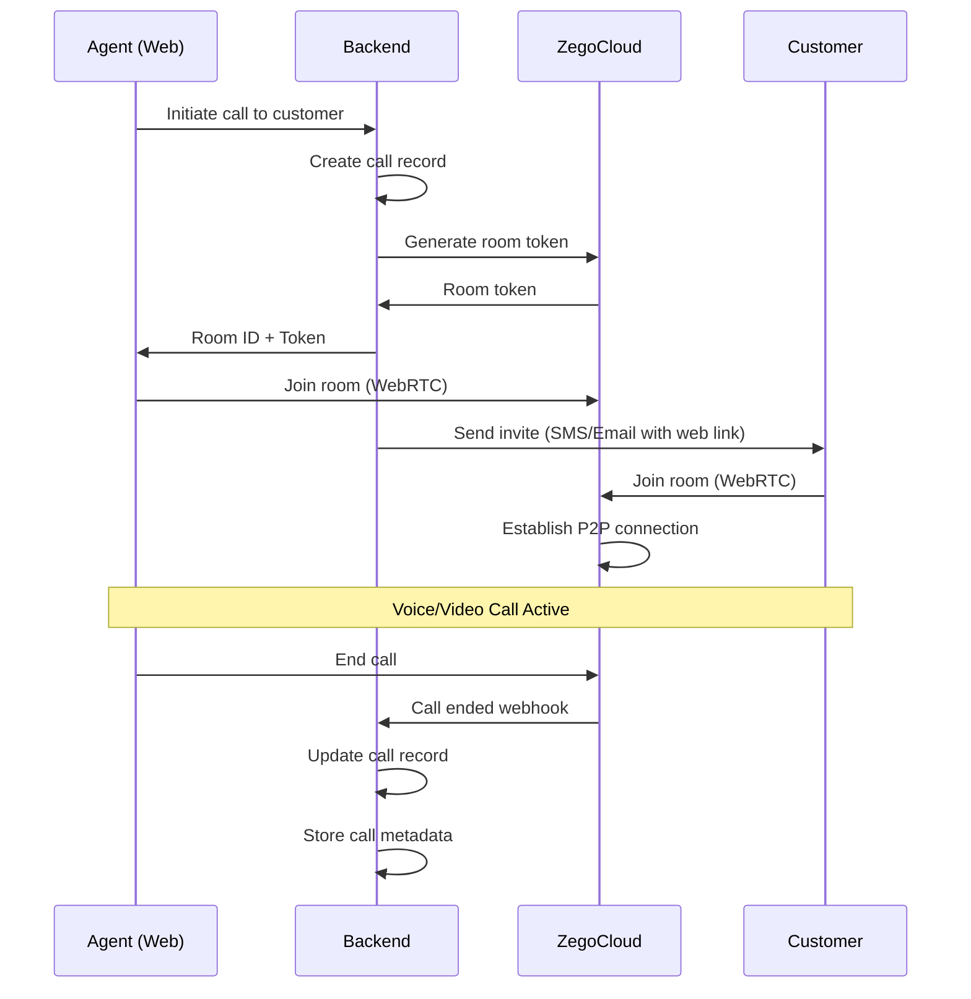
```mermaid
sequenceDiagram
    participant A as Agent (Web)
    participant B as Backend
    participant Z as ZegoCloud
    participant C as Customer

    A->>B: Initiate call to customer
    B->>B: Create call record
    B->>Z: Generate room token
    Z->>B: Room token
    B->>A: Room ID + Token
    A->>Z: Join room (WebRTC)
    B->>C: Send invite (SMS/Email with web link)
    C->>Z: Join room (WebRTC)
    Z->>Z: Establish P2P connection
    Note over A,C: Voice/Video Call Active
    A->>Z: End call
    Z->>B: Call ended webhook
    B->>B: Update call record
    B->>B: Store call metadata
```

### ClickUp Integration

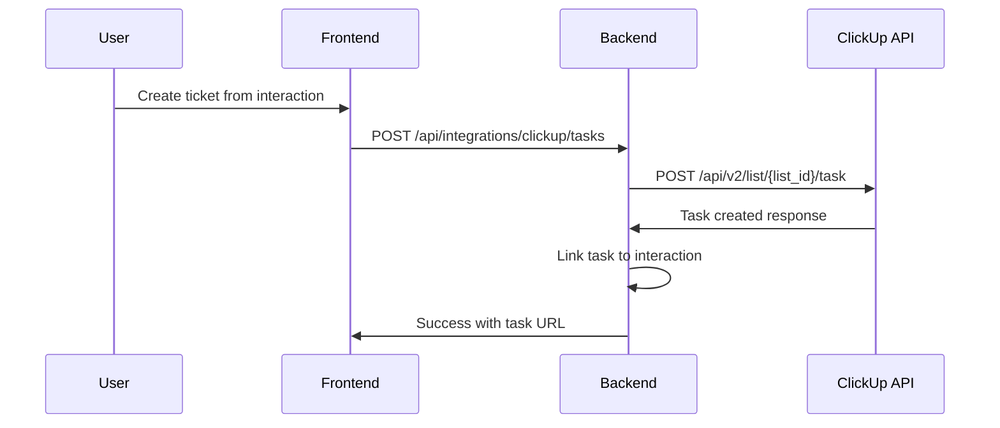
```mermaid
sequenceDiagram
    participant U as User
    participant F as Frontend
    participant B as Backend
    participant CU as ClickUp API

    U->>F: Create ticket from interaction
    F->>B: POST /api/integrations/clickup/tasks
    B->>CU: POST /api/v2/list/{list_id}/task
    CU->>B: Task created response
    B->>B: Link task to interaction
    B->>F: Success with task URL
```

---

## Data Architecture

### Entity Relationship Diagram

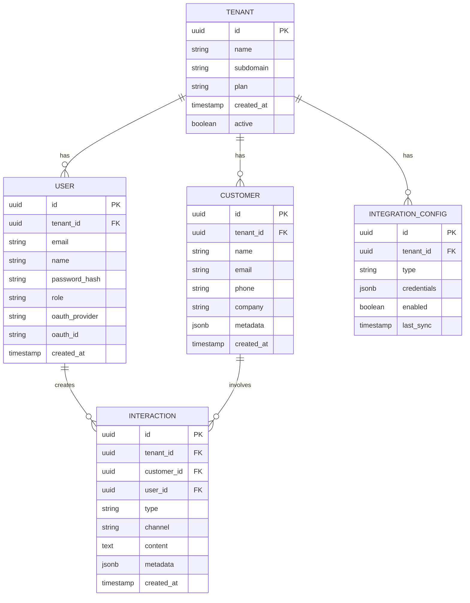
```mermaid
erDiagram
    TENANT ||--o{ USER : has
    TENANT ||--o{ CUSTOMER : has
    TENANT ||--o{ INTEGRATION_CONFIG : has
    
    USER ||--o{ INTERACTION : creates
    CUSTOMER ||--o{ INTERACTION : involves
    
    TENANT {
        uuid id PK
        string name
        string subdomain
        string plan
        timestamp created_at
        boolean active
    }
    
    USER {
        uuid id PK
        uuid tenant_id FK
        string email
        string name
        string password_hash
        string role
        string oauth_provider
        string oauth_id
        timestamp created_at
    }
    
    CUSTOMER {
        uuid id PK
        uuid tenant_id FK
        string name
        string email
        string phone
        string company
        jsonb metadata
        timestamp created_at
    }
    
    INTERACTION {
        uuid id PK
        uuid tenant_id FK
        uuid customer_id FK
        uuid user_id FK
        string type
        string channel
        text content
        jsonb metadata
        timestamp created_at
    }
    
    INTEGRATION_CONFIG {
        uuid id PK
        uuid tenant_id FK
        string type
        jsonb credentials
        boolean enabled
        timestamp last_sync
    }
```

### Search Architecture (Elasticsearch)

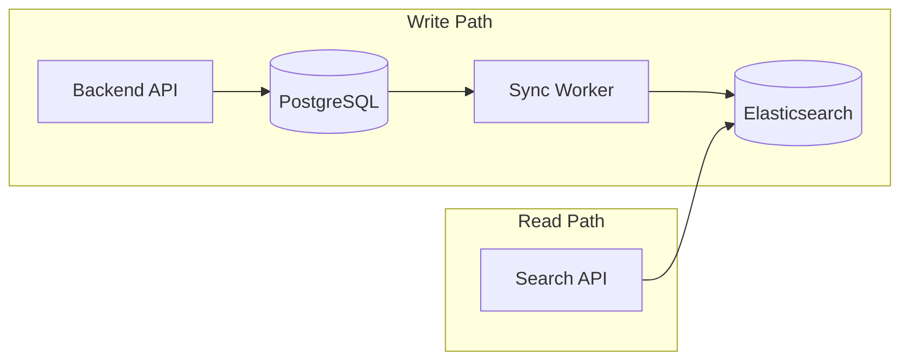
```mermaid
flowchart LR
    subgraph Write Path
        API[Backend API]
        DB[(PostgreSQL)]
        SYNC[Sync Worker]
        ES[(Elasticsearch)]
    end

    subgraph Read Path
        SEARCH[Search API]
        ES
    end

    API --> DB
    DB --> SYNC
    SYNC --> ES
    SEARCH --> ES
```

### Elasticsearch Index Mapping

```json
{
  "mappings": {
    "properties": {
      "id": { "type": "keyword" },
      "tenant_id": { "type": "keyword" },
      "customer_name": { 
        "type": "text",
        "analyzer": "standard"
      },
      "customer_email": { "type": "keyword" },
      "interaction_content": {
        "type": "text",
        "analyzer": "standard"
      },
      "created_at": { "type": "date" },
      "tags": { "type": "keyword" }
    }
  }
}
```

---

## Phase 2: AI & Voice

### AI Assistant Architecture

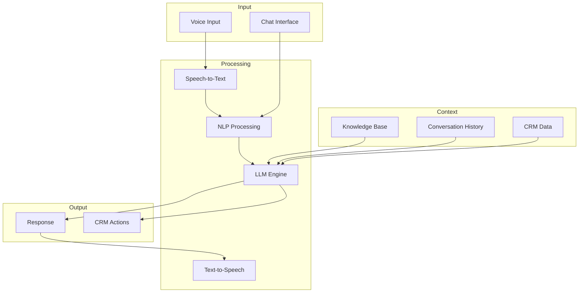
```mermaid
flowchart TB
    subgraph Input
        CHAT[Chat Interface]
        VOICE[Voice Input]
    end

    subgraph Processing
        STT[Speech-to-Text]
        NLP[NLP Processing]
        LLM[LLM Engine]
        TTS[Text-to-Speech]
    end

    subgraph Context
        KB[Knowledge Base]
        HIST[Conversation History]
        CRM[CRM Data]
    end

    subgraph Output
        RESP[Response]
        ACTION[CRM Actions]
    end

    VOICE --> STT
    STT --> NLP
    CHAT --> NLP
    NLP --> LLM
    
    KB --> LLM
    HIST --> LLM
    CRM --> LLM
    
    LLM --> RESP
    LLM --> ACTION
    RESP --> TTS
```

### STT/TTS Technology Choices

| Component | Primary Choice | Alternative |
|-----------|---------------|-------------|
| **STT** | OpenAI Whisper | Google Speech-to-Text |
| **TTS** | ElevenLabs | Amazon Polly |
| **LLM** | OpenAI GPT-4 | Claude, Local LLaMA |

### Meeting Summarization Pipeline

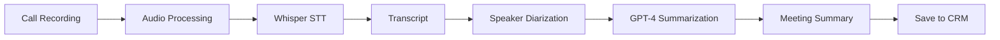
```mermaid
flowchart LR
    CALL[Call Recording] --> AUDIO[Audio Processing]
    AUDIO --> STT[Whisper STT]
    STT --> TRANSCRIPT[Transcript]
    TRANSCRIPT --> DIARIZE[Speaker Diarization]
    DIARIZE --> LLM[GPT-4 Summarization]
    LLM --> SUMMARY[Meeting Summary]
    SUMMARY --> CRM[Save to CRM]
```

### Sample AI Prompts

```yaml
# Customer Query Assistant
system_prompt: |
  You are a helpful CRM assistant for {tenant_name}.
  You have access to customer data and interaction history.
  Help agents with customer queries and suggest actions.
  
  Available actions:
  - SEARCH_CUSTOMER: Search for customer by name/email
  - CREATE_INTERACTION: Log a new interaction
  - SCHEDULE_FOLLOWUP: Schedule a follow-up task
  - GET_HISTORY: Retrieve customer interaction history

# Meeting Summarization
summarization_prompt: |
  Summarize the following meeting transcript.
  Include:
  - Key discussion points
  - Action items with assignees
  - Decisions made
  - Follow-up required
  
  Format as structured markdown.
  
  Transcript:
  {transcript}
```

### Data Flow for AI Features

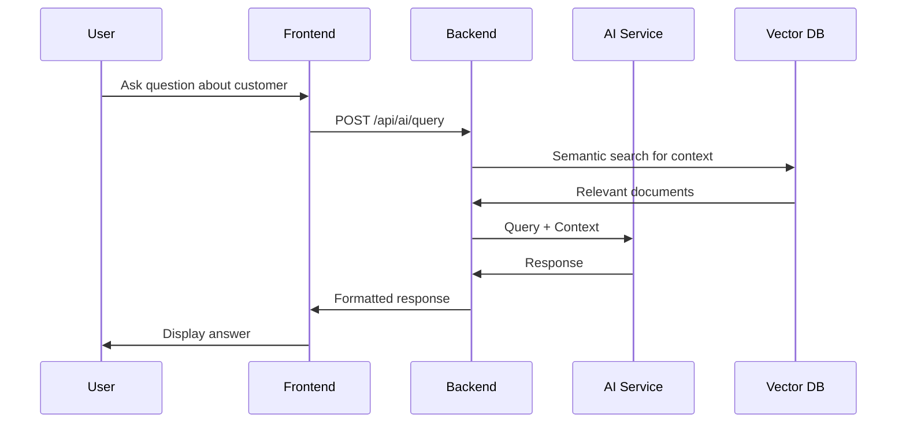
```mermaid
sequenceDiagram
    participant U as User
    participant F as Frontend
    participant B as Backend
    participant AI as AI Service
    participant VEC as Vector DB

    U->>F: Ask question about customer
    F->>B: POST /api/ai/query
    B->>VEC: Semantic search for context
    VEC->>B: Relevant documents
    B->>AI: Query + Context
    AI->>B: Response
    B->>F: Formatted response
    F->>U: Display answer
```

---

## Infrastructure

### Docker Compose Services

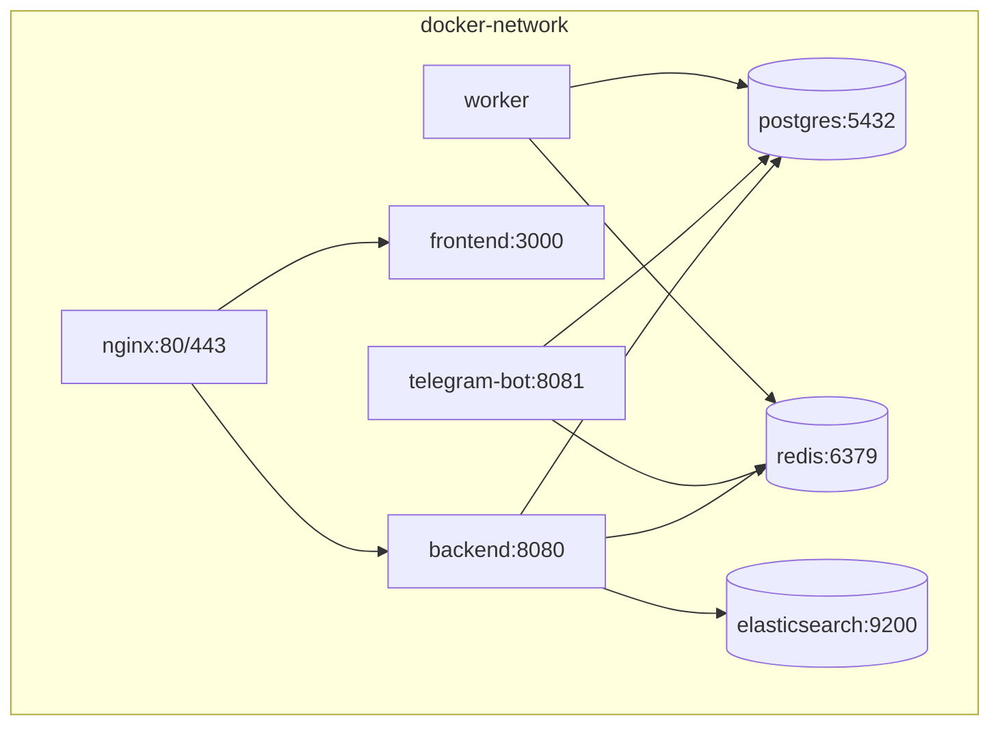
```mermaid
flowchart TB
    subgraph docker-network
        NGINX[nginx:80/443]
        BACKEND[backend:8080]
        FRONTEND[frontend:3000]
        BOT[telegram-bot:8081]
        WORKER[worker]
        
        PG[(postgres:5432)]
        REDIS[(redis:6379)]
        ES[(elasticsearch:9200)]
    end

    NGINX --> BACKEND
    NGINX --> FRONTEND
    BACKEND --> PG
    BACKEND --> REDIS
    BACKEND --> ES
    BOT --> PG
    BOT --> REDIS
    WORKER --> PG
    WORKER --> REDIS
```

### Kubernetes Deployment (Production)

```mermaid
flowchart TB
    subgraph Kubernetes Cluster
        subgraph Ingress
            ING[Ingress Controller]
        end
        
        subgraph Services
            BE_SVC[Backend Service]
            FE_SVC[Frontend Service]
            BOT_SVC[Bot Service]
        end
        
        subgraph Deployments
            BE_DEP[Backend Pods x3]
            FE_DEP[Frontend Pods x2]
            BOT_DEP[Bot Pods x1]
            WORKER_DEP[Worker Pods x2]
        end
        
        subgraph StatefulSets
            PG_SS[PostgreSQL]
            REDIS_SS[Redis]
            ES_SS[Elasticsearch]
        end
    end

    ING --> BE_SVC
    ING --> FE_SVC
    BE_SVC --> BE_DEP
    FE_SVC --> FE_DEP
    BOT_SVC --> BOT_DEP
```

### CI/CD Pipeline

```mermaid
flowchart LR
    subgraph Trigger
        PUSH[Git Push]
        PR[Pull Request]
    end

    subgraph Build
        LINT[Lint]
        TEST[Test]
        BUILD[Build]
    end

    subgraph Package
        DOCKER[Docker Build]
        PUSH_REG[Push to Registry]
    end

    subgraph Deploy
        STAGING[Deploy Staging]
        E2E[E2E Tests]
        PROD[Deploy Production]
    end

    PUSH --> LINT
    PR --> LINT
    LINT --> TEST
    TEST --> BUILD
    BUILD --> DOCKER
    DOCKER --> PUSH_REG
    PUSH_REG --> STAGING
    STAGING --> E2E
    E2E --> PROD
```

---

## Security Architecture

### Data Isolation Verification

```mermaid
flowchart TB
    subgraph Test Cases
        T1[Cross-tenant query test]
        T2[JWT tenant claim validation]
        T3[API endpoint isolation test]
        T4[Database RLS test]
    end

    subgraph Verification
        V1[Unit Tests]
        V2[Integration Tests]
        V3[Penetration Tests]
    end

    T1 --> V1
    T2 --> V1
    T3 --> V2
    T4 --> V3
```

### Secret Storage

```mermaid
flowchart LR
    subgraph Development
        ENV[.env files]
    end

    subgraph Production
        VAULT[HashiCorp Vault]
        AWS_SM[AWS Secrets Manager]
        K8S_SEC[Kubernetes Secrets]
    end

    subgraph Application
        APP[Application]
    end

    ENV --> APP
    VAULT --> APP
    AWS_SM --> APP
    K8S_SEC --> APP
```

---

## Appendix

### Technology Decision Matrix

| Decision | Choice | Rationale |
|----------|--------|-----------|
| Multi-tenancy | Row-level | Simpler migrations, lower cost |
| Auth | OAuth2 + JWT | Industry standard, social login support |
| Database | PostgreSQL | JSONB support, RLS capability |
| Cache | Redis | Session storage, rate limiting |
| Search | Elasticsearch | Full-text search, analytics |
| Voice/Video | ZegoCloud | WebRTC, SDK support |
| Task Management | ClickUp | API availability, features |
| STT | Whisper | Accuracy, cost-effective |
| LLM | GPT-4 | Capability, API reliability |

### References

- [Spring Security OAuth2](https://docs.spring.io/spring-security/reference/servlet/oauth2/index.html)
- [ZegoCloud Documentation](https://doc-en.zego.im/)
- [ClickUp API](https://clickup.com/api)
- [Telegram Bot API](https://core.telegram.org/bots/api)
- [OpenAI API](https://platform.openai.com/docs/)

